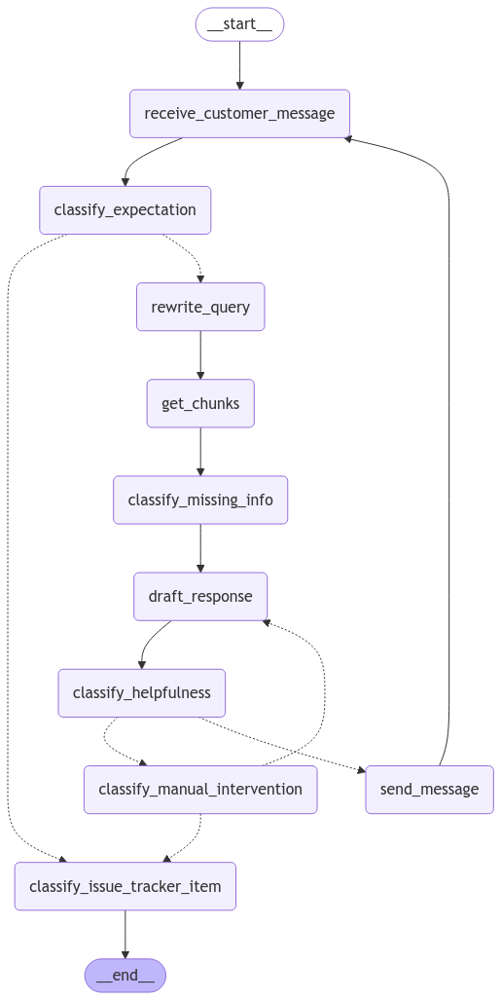

# customerChatbotLanggraph
A chatbot with a LangGraph workflow that incorporates query rewriting RAG using your documentation, only structured output to reduce hallucination, rewording of unhelpful responses, but no endless loops, detection when manual intervention is necessary, and integration of issue tracking.

## The LangGraph graph

The nodes are:
* `classify_expectation` classifies whether the customer expects a response (if not, go directly to `classify_issue_tracker_item`)
* `classify_issue_tracker_item` classifies 
whether a new issue tracker item needs to be created
* `rewrite_query` rewrites the query `TOP_K_FUSION_QUERIES` times for better chunk coverage in RAG
* `get_chunks` gets the `TOP_K_CHUNKS` chunks for the original query and all rewritten queries, each with its top similarity score
* `classify_missing_info` classifies whether there is information missing from the customer.
* `draft_response` creates a draft response to the customer
* `classify_helpfulness` classifies whether the draft response moves the chat forward towards a solution by giving or asking for relevant information (if not, do a `classify_manual_intervention`)
* `classify_manual_intervention` classifies whether a human should intervene (if not and the number of retries for the current customer query is < `RETRIES`, go back to `draft_response`).
